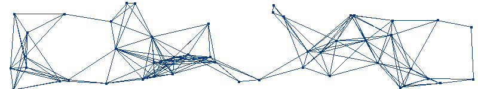

<html>
  <head>
    <meta charset="UTF-8">
    <title>GitHub Profile README - Daniel Moura do Nascimento</title>
    
  </head>
  <body>
    <!-- Cabeçalho animado: substituído o canvas pelo GIF animado -->
    
    
    

      <!-- Header principal -->
      

        

          
        

        

          
          
        

      

      
      <!-- Sobre Mim -->
      

        <h2>🚀 Sobre Mim</h2>
        

          Sou um cientista de dados apaixonado por Machine Learning, Deep Learning e soluções IoT. Atualmente, exploro o universo da Inteligência Artificial,
          combinando algoritmos inovadores e ferramentas modernas para transformar dados em soluções que impactam positivamente a sociedade.
        

      

      
      <!-- Tecnologias e Ferramentas -->
      

        <h2>🖥️ Tecnologias e Ferramentas</h2>
        

          
          
          
          
          
          
          
          
          
          
          
          
          
          
          
        

      

      
      <!-- Projetos -->
      

        <h2>Projetos</h2>
        

          <!-- Projeto 1 -->
          

            <h3>🔍 Projeto Destaque</h3>
            <h4>DriveBehaviour</h4>
            

              Sistema de análise de comportamento de direção utilizando Random Forest, KMeans e PCA com 92% de acurácia.
              Desenvolvido com Python e SciKit-Learn.
            

            

              
              
            

          

          <!-- Projeto 2 -->
          

            <h3>🤖 Impacto Social</h3>
            <h4>Um Robô Por Aluno</h4>
            

              Iniciativa educacional para ensino de robótica e IoT em escolas públicas, promovendo inclusão digital e soluções práticas para problemas reais.
            

            

              
              
            

          

        

      

      
      <!-- GitHub Stats (lado a lado) -->
      

        <h2>📊 GitHub Stats</h2>
        

          
          
        

      

      
      <!-- Seção de Contato -->
      

        <h2>⤵️ Onde Me Encontrar</h2>
        

          
          
          
        

      

    

  </body>
</html>
